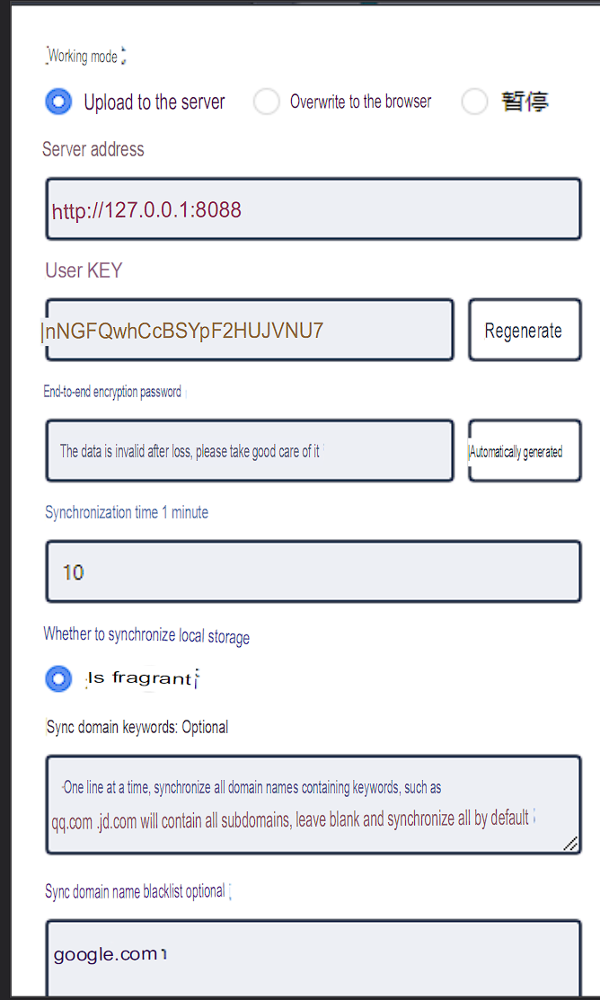
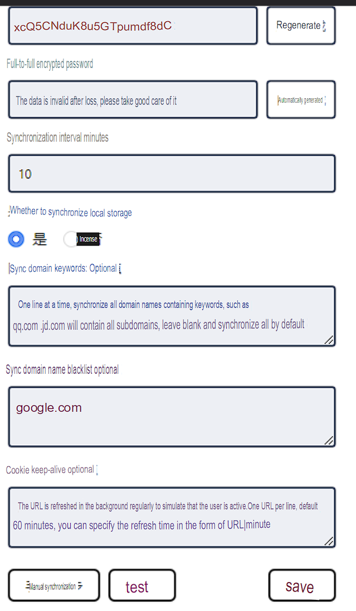

# ScraperCookieCloud

Testing using Browserless (well Selenium) and Cookiecloud for web scraping.

## Requirements

* Browserless: https://github.com/browserless/browserless
    * Although really just using it as a Selinium Driver - example values for Environment Variables
        * WEBDRIVER_URL="http://127.0.0.1:3000/webdriver"
        * WEBDRIVER_POLL_TIMEOUT=100
* CookieCloud: 
    * Server: https://github.com/easychen/CookieCloud
    * Chrome Plugin: https://chromewebstore.google.com/detail/cookiecloud/ffjiejobkoibkjlhjnlgmcnnigeelbdl
* PyCookieCloud:
    * Python wrapeer for interacting with CookieCloud server: https://github.com/lupohan44/PyCookieCloud

I've setup both as "apps" in Unraid

## Setup

The idea is that on a device that used to actually navigate the web by a human, install the CookeCloud Chrome Plugin, which will sync cookie data to the CookieCloud Server.

**Probably don't want to install the Chrome Plugin on your actual day to day web browser - because it could leak more information than we think it does.**

The script will retrieve the cookie data to inject into the browserless session, which should help access content that requires a login and other state information.

### Chrome Plugin

The plugin isn't in English which makes configuring it a challenge. Heres a translation sourced from an issue on the github.

* `Server Address` = `PYCOOKIE_URL` e.g. "http://127.0.0.1:8088/"
* `User Key` = `PYCOOKIE_UUID`
* `End-to-end Encryption Password` = `PYCOOKIE_PASSWORD`

## Running

To run the flask app:
`python3 -m flask run --host=0.0.0.0`

Then to grab the source and a long screen shot of a page:
`http://127.0.0.1:5000/run?url=https://github.com`